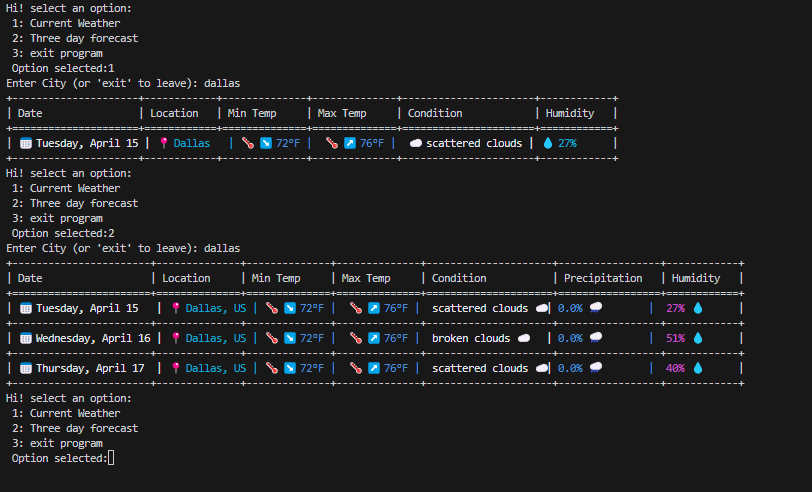

# Weather Checker ☀️🌧️ Version 1.0.0
**Weather Checker** is a command-line weather application that fetches real-time weather data and a 3-day forecast from the [OpenWeather API](https://openweathermap.org/api). It displays data in beautifully formatted, colorful tables enhanced with emojis using [Colorama](https://github.com/tartley/colorama) and [Tabulate](https://github.com/astanin/python-tabulate).

Experience a vibrant, modern terminal interface for all your weather-checking needs!

---

## Table of Contents 📚

- [Features ✨](#features-)
- [Installation 🛠️](#installation-)
- [Usage 🚀](#usage-)
- [Project Structure 📁](#project-structure-)
- [Contributing 🤝](#contributing-)
- [License 📄](#license-)
- [Acknowledgments 🙏](#acknowledgments-)

---

## Features ✨

- **Real-Time Weather:** Retrieve current weather details for any city.
- **3-Day Forecast:** View a detailed forecast for three consecutive days.
- **Vibrant Terminal Output:** Enjoy colorful, emoji-enhanced tables for increased visual clarity.
- **User-Friendly Interface:** Simple, menu-driven interaction with prompt inputs.
- **Robust Error Handling:** Informative messages for invalid inputs or API issues.

---

## Installation 🛠️

Follow these steps to install and set up the **Weather Checker** project:

### Prerequisites

Make sure you have the following prerequisites installed:
- **Python 3.6 or above**  
  [Download Python](https://www.python.org/downloads/)
- An active **[OpenWeather API key](https://openweathermap.org/api)** (you’ll need to sign up and generate a key if you don’t already have one).

### Clone the Repository

Start by cloning the repository from GitHub using the command below:
```bash
git clone https://github.com/oakzd/weather-app.git
```

### Navigate into the newly created directory

Run command below:
```bash
cd weather-app
```

### Create a Virtual Environment (Optional but Recommended)

A virtual environment helps isolate your project dependencies from the global Python environment. 
Create and activate a virtual environment using the following commands:

For macOS/Linux:
```bash
python3 -m venv weather_env
source weather_env/bin/activate
```
For Windows::
```bash
python -m venv weather_env
weather_env\Scripts\activate
```

### Install Dependencies
The required Python libraries for this project are listed in the requirements.txt file. Install them by running:
```bash
pip install -r requirements.txt
```
This will install all the necessary dependencies, including:
- **Requests** : for making API calls
- **Tabulate**: for creating clean, formatted tables
- **Colorama**:: For colorful terminal output


### Configure the Project
The required Python libraries for this project are listed in the requirements.txt file. Install them by running:
```python
# config.py
API_KEY = "YOUR_OPENWEATHER_API_KEY"
```
Replace "YOUR_OPENWEATHER_API_KEY" with your actual API key. 
Keep this file secure and avoid committing sensitive info to public repositories.

## Usage 🚀
With everything set up, run the application from your terminal:
```bash
python main.py
```
Once ran you will see the following...

Hi! select an option:
1. Current Weather
2. Three day forecast
3. Exit program

Option selected: 1


### Sample Output



## Project Structure 📁
weather-app/

├── __pycache__/          # Python cache files

├── weather_env/          # Virtual environment folder

├── .gitignore            # Git ignore file for sensitive info like virtual environments

├── config.py             # API key configuration (do not expose sensitive info)

├── main.py               # Main Python script containing all functionality

├── pre-release.py        # Additional script for pre-release testing (if applicable)

├── requirements.txt      # List of Python dependencies

└── README.md             # Project documentation


## Project Structure 🤝

Contributions, bug fixes, and feature requests are welcome! To contribute:
1. Fork the repository.
2. Create a new branch for your feature:
```bash
git checkout -b feature/YourFeature
```
3. Commit your changes with clear commit messages:
```bash
git commit -m "Add description of your feature"
```
4. Push the branch:
```bash
git push origin feature/YourFeature
```
5. Open a Pull Request with details of your changes.

Please adhere to the existing code style and include proper documentation/comments with your modifications.

## License 📄
This project is licensed under the MIT License.

## Acknowledgments 🙏
- **OpenWeatherMap** : For providing the excellent weather API.
- **Colorama & Tabulate** : For enabling colorful and beautifully formatted terminal outputs.
- A big thank you to all our users and contributors for their support and feedback!
